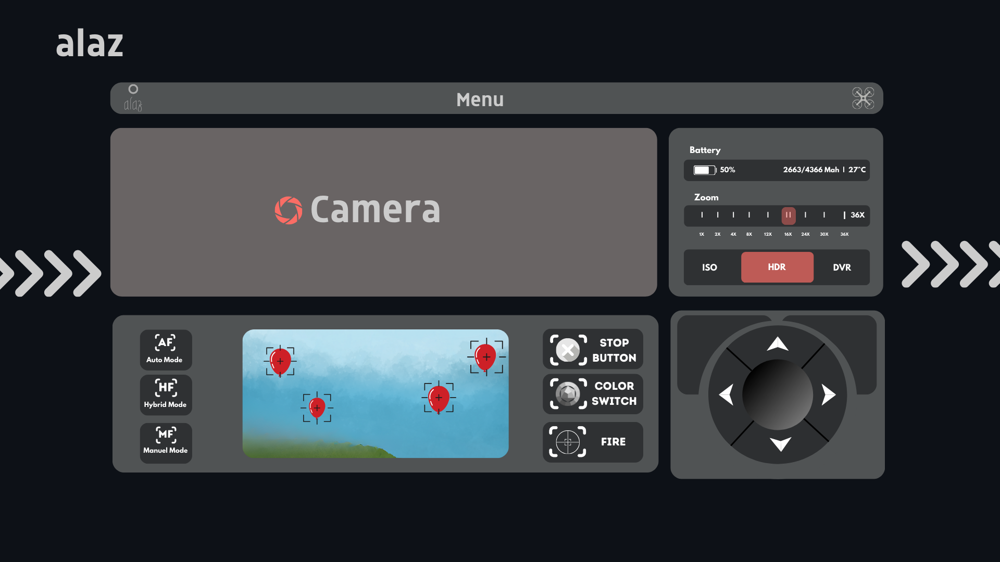
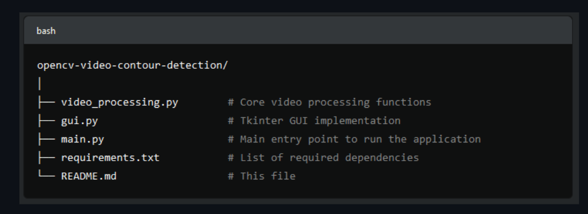
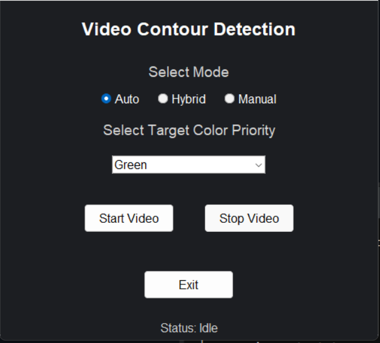

### OpenCV Video Contour Detection Application

## About The Project

Welcome to the OpenCV Video Contour Detection project! This project showcases real-time video processing using OpenCV integrated with a responsive and modern GUI built with Tkinter. The application provides three operational modes (Auto, Hybrid, and Manual) and allows users to select target priority from various color options. It also incorporates features like FPS display, dynamic color range adjustment, and contour detection.



## Features

1. Real-Time Contour Detection
   Detect and highlight objects (contours) in real-time based on user-selected color ranges.

2. Three Operational Modes

   - Auto: Automatically detects contours without user input.
   - Hybrid: Balances between automatic and manual detection with fine-tuning options.
   - Manual: Users can manually adjust settings to detect specific objects based on color priority.

3. Dynamic Color Adjustment
   Adjust the HSV (Hue, Saturation, Value) ranges dynamically through a trackbar interface to fine-tune contour detection.

4. Target Priority Selection
   Choose which color (Red, Green, Blue, or Yellow) to prioritize when detecting objects in the video feed.

5. User-Friendly GUI
   The application is designed with an aesthetic, simplistic dark theme to enhance user experience, with buttons for video control and real-time status updates.

6. Performance Metrics
   The application calculates and displays the Frames Per Second (FPS) in real-time, ensuring optimal performance visibility.

## Installation

- Python 3.x: Ensure that Python 3.x is installed on your machine.
- OpenCV: Install OpenCV for video processing capabilities.
- Tkinter: Tkinter is the GUI framework used, and it comes pre-installed with Python.
- NumPy: Used for array operations in video processing.

1. Clone the repository:
   ```sh
   git clone https://github.com/muhkartal/alaz
   ```
2. Install the required Python packages:

   ```sh
   pip install -r requirements.txt
   ```

   > If you do not have a `requirements.txt file`, manually install the required libraries with:

   ```sh
   pip install tkinter opencv-python numpy logging time pillow
   ```

3. Run the Application
   ```sh
   python main.py
   ```

## How It Works

The application captures real-time video feed from your webcam, processes the frames in different modes, and applies contour detection on objects that match the selected color. The user can adjust the color range dynamically via sliders, and select the operating mode and target color priority.


1.  Video Capture: Video is captured using OpenCV’s VideoCapture method.
2.  Color Range Adjustment: Trackbars allow dynamic tuning of the HSV color space for precision detection.
3.  Mode Selection: Choose between Auto, Hybrid, or Manual modes for video processing.
4.  Contour Detection: The system detects and highlights contours based on the color priority.
5.  Performance Display: The application calculates FPS to monitor real-time performance.

## Modes of Operation

- Auto Mode: Automatically detects objects based on predefined color ranges.
- Hybrid Mode: Combines automatic detection with manual adjustment for user-defined precision.
- Manual Mode: Gives full control to the user to define target objects through HSV range and color priority settings.



## Future Improvements

- Custom Target Shapes: In addition to color-based detection, allow for detecting specific shapes like circles, squares, etc.
- Multiple Camera Support: Add functionality to switch between different camera sources.
- Advanced Performance Tuning: Optimize the application for high FPS and low latency on different hardware configurations.

## Contributing

We welcome contributions to improve the project. Feel free to fork the repository, make changes, and submit a pull request. Ensure your code follows the existing style and includes proper documentation.

## License

> This project is licensed under the MIT License. See the LICENSE file for more details.

## Contact

If you encounter any issues, feel free to open an issue or reach out to me [via email](muhammed_ikarta@outlook.com).
